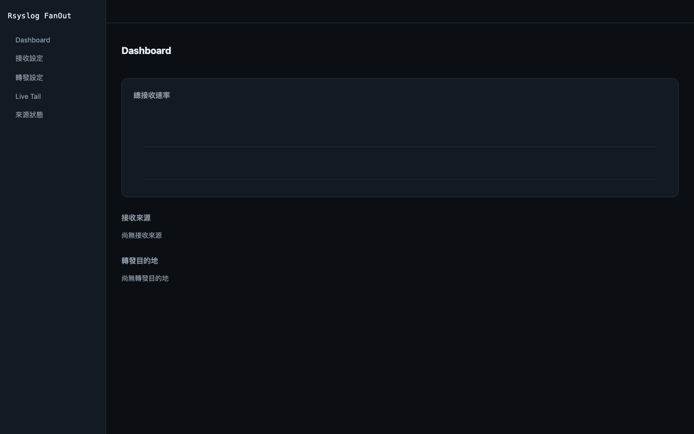

# Rsyslog FanOut

[繁體中文](README.zh-TW.md)

A containerized syslog fan-out (one-in, many-out relay) tool with a WebUI — built on **rsyslog** as the battle-tested transport engine. Transparent relay is the default: downstream receivers get byte-for-byte the same syslog payload the device originally sent.



## Quick Start

```bash
git clone https://github.com/<your-org>/Rsyslog-FanOut.git && cd Rsyslog-FanOut
export FANOUT_ADMIN_PASSWORD=change-me-please
cd docker && docker compose up -d --build
```

Open `http://localhost:8080`, log in with the password you set above, then configure an input, a destination, and a route, and click **Apply**.

## Core Concepts

| Entity | Meaning |
|---|---|
| **Input** | A listening port (`udp`/`tcp`) that accepts syslog from your devices. Must fall inside `FANOUT_PORT_RANGE`. |
| **Destination** | Where matched messages are forwarded (`host:port`, `udp`/`tcp`), with a **header mode**: |
| — `raw` (default) | Transparent relay — forwards the original `%rawmsg%` byte-for-byte. |
| — `standard` | Rewrites the header to RFC 3164 while preserving the original timestamp/hostname. |
| **Route** | An Input → Destination mapping, with optional filters: source IP/CIDR, facility (multi-select), minimum severity. No filter = forward everything. |

Changes are saved as drafts in SQLite; nothing takes effect on the wire until you click **Apply**, which generates a new rsyslog config, validates it (`rsyslogd -N1`), swaps it in, and restarts rsyslogd — rolling back automatically if the new config fails to start.

## Port Range

Docker cannot add port mappings at runtime, so the set of ports you can listen on must be published in `docker/docker-compose.yml` up front and mirrored in the `FANOUT_PORT_RANGE` environment variable — the WebUI only allows creating inputs on ports inside that range.

Defaults: `514/udp`, `514/tcp`, and `5140-5199` (UDP+TCP).

To add more ports:

1. Edit `docker/docker-compose.yml` — add the port(s) under `ports:` (e.g. `9000-9010:9000-9010/udp`).
2. Update `FANOUT_PORT_RANGE` to match, e.g. `"514,5140-5199,9000-9010"`.
3. `docker compose up -d --build` to recreate the container with the new mapping.

## Known Limitations

- **Sub-second interruption on Apply.** rsyslog has no hot-reload for new listening ports, so applying a config restarts rsyslogd (typically <1s). TCP sources reconnect automatically; UDP packets in flight during that window are lost — this is inherent to rsyslog, not a bug in this tool.
- **Relay source IP.** Like any relay, forwarded packets arrive at the downstream host with *this tool's* IP as the packet-layer source, not the original device's IP. If downstream systems rely on the syslog header's hostname field instead of the packet source, this doesn't affect them.
- **No TLS / RELP.** Only plain UDP/TCP transport is supported today; encrypted/reliable transports are a roadmap item.
- **WebUI is HTTP only.** The session cookie is `httpOnly` + `sameSite=strict` but does **not** set the `secure` flag, because the server does not terminate TLS itself. If you need HTTPS (e.g. exposing the WebUI beyond a trusted LAN), put a reverse proxy (nginx, Caddy, Traefik, ...) in front of it and terminate TLS there.

## Environment Variables

| Variable | Default | Meaning |
|---|---|---|
| `FANOUT_ADMIN_PASSWORD` | *(required)* | Initial admin password; can be changed after login. |
| `FANOUT_PORT_RANGE` | `514,5140-5199` | Comma-separated list of ports/ranges the WebUI is allowed to open as inputs. Must match the ports published in `docker-compose.yml`. |
| `FANOUT_STALE_MINUTES` | `10` | Minutes of silence from a source IP before it's flagged as stale/disconnected on the Sources page. |
| `FANOUT_DATA_DIR` | `/data` | Directory holding the SQLite config DB, generated rsyslog conf, and config backups. |
| `FANOUT_HTTP_PORT` | `8080` | Port the management WebUI/API listens on. |
| `FANOUT_TAIL_PORT` | `15514` | Internal loopback-only UDP port used to stream a copy of received messages into Live Tail. Not exposed outside the container. |
| `RSYSLOGD_BIN` | `rsyslogd` | Path to the rsyslogd binary, if not on `PATH`. |

**Source IP filtering** on a route accepts either a full IPv4 address (e.g. `10.0.0.5`) or a `/8`, `/16`, or `/24` CIDR prefix (e.g. `10.0.0.0/16`); other mask lengths are rejected by validation.

## Volumes

- `/data` (named volume `fanout-data` in the compose file) — SQLite database, generated rsyslog config, and pre-apply config backups. This is the single source of truth for your configuration; back it up if you care about not re-entering inputs/destinations/routes.

## Development

Requires **Node.js 22+** (the server's `better-sqlite3@13` dependency requires Node ≥22 for its prebuilt binaries).

```bash
# Backend (Fastify + TypeScript), with hot reload
cd server && npm install && npm run dev

# Frontend (Vue 3 + Vite), proxies /api to localhost:8080
cd web && npm install && npm run dev
```

Tests:

```bash
cd server && npm run test:coverage   # unit + integration, ≥80% coverage gate
cd web && npm test                   # component/unit tests
```

### End-to-end tests

```bash
cd docker && FANOUT_ADMIN_PASSWORD=devpass docker compose up -d --build
cd ../e2e && npm install && npx playwright test
```

The E2E suite covers the main UI flows with Playwright (login, configure input/destination/route, apply, dashboard/live-tail assertions, responsive screenshots) and also runs `e2e/scripts/transparency-test.sh` — a byte-level check that sends a syslog message through the full input → route → destination pipeline and asserts the bytes received downstream are **identical** to what was sent. That guarantee — transparent, unmodified relay by default — is this project's headline feature, so it's verified at the byte level, not just "a message arrived."

## License

[MIT](LICENSE) © 2026 susualou
