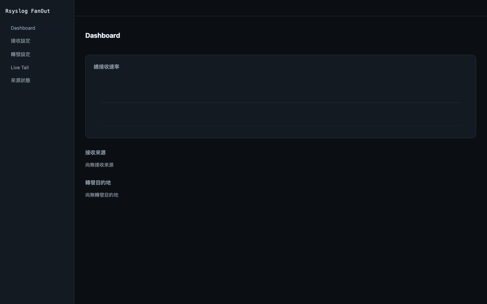

# Rsyslog FanOut

[繁體中文](README.zh-TW.md)

A containerized syslog fan-out (one-in, many-out relay) tool with a WebUI — built on **rsyslog** as the battle-tested transport engine. Transparent relay is the default: downstream receivers get byte-for-byte the same syslog payload the device originally sent.



## Quick Start

```bash
git clone https://github.com/huangalou/rsyslog-fanout.git && cd rsyslog-fanout
export FANOUT_ADMIN_PASSWORD=$(openssl rand -base64 12)
echo "Admin password: $FANOUT_ADMIN_PASSWORD"   # note it down — you'll need it to log in
cd docker && docker compose up -d --build
```

Open `http://localhost:8080`, log in with the password you set above, then configure an input, a destination, and a route, and click **Apply**.

## Core Concepts

| Entity | Meaning |
|---|---|
| **Input** | A listening port (`udp`/`tcp`) that accepts syslog from your devices. Must fall inside `FANOUT_PORT_RANGE`. A `tcp` input can require TLS. |
| **Destination** | Where matched messages are forwarded (`host:port`, `udp`/`tcp`, optionally over TLS), with a **header mode**: |
| — `raw` (default) | Transparent relay — forwards the original `%rawmsg%` byte-for-byte. |
| — `standard` | Rewrites the header to RFC 3164 while preserving the original timestamp/hostname. |
| **Route** | An Input → Destination mapping, with optional filters: source IP/CIDR, facility (multi-select), minimum severity. No filter = forward everything. |

Changes are saved as drafts in SQLite; nothing takes effect on the wire until you click **Apply**, which generates a new rsyslog config, validates it (`rsyslogd -N1`), swaps it in, and restarts rsyslogd — rolling back automatically if the new config fails to start.

## WebUI Language

The WebUI is bilingual (English / Traditional Chinese). The initial language follows the browser's language (`zh*` → 繁體中文, anything else → English); a switcher in the top bar (and on the login page) overrides it, and the choice is persisted in `localStorage`.

API error responses carry a stable machine-readable code so the UI can localize them:

```json
{ "success": false, "data": null, "error": { "code": "PORT_OUT_OF_RANGE", "message": "Port 9999 is outside the allowed range (FANOUT_PORT_RANGE=514...)", "params": { "port": 9999, "range": "FANOUT_PORT_RANGE=514..." } } }
```

`message` is always English (for `curl`/programmatic use); the WebUI translates known `code`s into the active language.

## Port Range

Docker cannot add port mappings at runtime, so the set of ports you can listen on must be published in `docker/docker-compose.yml` up front and mirrored in the `FANOUT_PORT_RANGE` environment variable — the WebUI only allows creating inputs on ports inside that range.

Defaults: `514/udp`, `514/tcp`, and `5140-5199` (UDP+TCP).

To add more ports:

1. Edit `docker/docker-compose.yml` — add the port(s) under `ports:` (e.g. `9000-9010:9000-9010/udp`).
2. Update `FANOUT_PORT_RANGE` to match, e.g. `"514,5140-5199,9000-9010"`.
3. `docker compose up -d --build` to recreate the container with the new mapping.

## TLS

Syslog over TLS (RFC 5425) is supported in both directions, on `tcp` only. TLS and plain-text inputs can run side by side.

**Certificate files are mounted into the container, never uploaded through the WebUI** (the WebUI is plain HTTP, so a private key must not travel through it). Put them in `/data/tls` (override with `FANOUT_TLS_DIR`):

| File | Used for | Required |
|---|---|---|
| `cert.pem` + `key.pem` | The server certificate presented by TLS inputs | When any TLS input is enabled |
| `ca.pem` | CA bundle used to verify TLS destinations | Optional; defaults to the system trust store |

```bash
docker cp cert.pem rsyslog-fanout:/data/tls/cert.pem
docker cp key.pem  rsyslog-fanout:/data/tls/key.pem
docker cp ca.pem   rsyslog-fanout:/data/tls/ca.pem    # only for a private CA
```

Then in the WebUI:

- **Input** — choose `tcp` and tick **Enable TLS**. The form shows whether the server certificate is in place; Apply is rejected (`TLS_CERT_MISSING`) while it is not. Clients are not asked for a certificate.
- **Destination** — choose `tcp` and a TLS mode:
  - **Verify certificate** (recommended): the destination's certificate must chain to a trusted CA *and* match a name. The name defaults to the Host field; set **Certificate name** when you connect by IP but the certificate was issued to a DNS name (IP addresses in certificates are not matched). A leading wildcard such as `*.example.com` is accepted; broader patterns like `*` or `*.com` are rejected.
  - **Encrypt only, no verification**: for labs with self-signed certificates. The peer is not authenticated.

Good to know:

- After replacing certificate files, click **Apply** (or restart the container) for rsyslog to pick them up.
- `ca.pem` *replaces* the system trust store. To trust both public CAs and a private CA, concatenate them into one file.
- If `cert.pem`/`key.pem` are present, rsyslog also presents that certificate as a client certificate to TLS destinations that request one.
- The standard syslog-TLS port `6514` is not in the default `FANOUT_PORT_RANGE`; add it there and to the published ports in `docker-compose.yml` if you want it (see [Port Range](#port-range)).

## Integration Example: CyberRange

FanOut pairs naturally with [CyberRange](https://github.com/huangalou/CyberRange), a catalog-driven log generator for SIEM detection validation: point its UDP sink at a FanOut input, and FanOut fans the stream out to one or more SIEMs transparently.

```bash
# 1. In the WebUI: create an Input (e.g. udp/5160), a Destination per SIEM
#    (headerMode: raw), a Route linking them, then Apply.

# 2. Fire vendor-realistic logs at the input:
cyberrange gen \
  --vendor fortinet --product fortios --version 7.4 --log-type traffic.forward \
  --count 1000 --rate 50 --sink udp://<fanout-host>:5160
```

Verified end-to-end (2026-08-15): FortiOS key-value, CEF, and RFC 3164 payloads generated by CyberRange arrived at the downstream receiver byte-identical to what was sent (`headerMode: raw`), with correct facility/severity parsing shown in Live Tail.

## Known Limitations

- **Sub-second interruption on Apply.** rsyslog has no hot-reload for new listening ports, so applying a config restarts rsyslogd (typically <1s). TCP sources reconnect automatically; UDP packets in flight during that window are lost — this is inherent to rsyslog, not a bug in this tool.
- **Relay source IP.** Like any relay, forwarded packets arrive at the downstream host with *this tool's* IP as the packet-layer source, not the original device's IP. If downstream systems rely on the syslog header's hostname field instead of the packet source, this doesn't affect them.
- **No RELP.** Transport is UDP, TCP, or TCP with TLS.
- **TLS scope.** TLS inputs do not verify client certificates (restrict senders with a route's source filter or at the network layer). All TLS destinations share one CA bundle and one client certificate.
- **WebUI is HTTP only.** The session cookie is `httpOnly` + `sameSite=strict` but does **not** set the `secure` flag, because the server does not terminate TLS itself. If you need HTTPS (e.g. exposing the WebUI beyond a trusted LAN), put a reverse proxy (nginx, Caddy, Traefik, ...) in front of it and terminate TLS there.

## Environment Variables

| Variable | Default | Meaning |
|---|---|---|
| `FANOUT_ADMIN_PASSWORD` | *(required)* | Initial admin password; can be changed after login. |
| `FANOUT_PORT_RANGE` | `514,5140-5199` | Comma-separated list of ports/ranges the WebUI is allowed to open as inputs. Must match the ports published in `docker-compose.yml`. |
| `FANOUT_STALE_MINUTES` | `10` | Minutes of silence from a source IP before it's flagged as stale/disconnected on the Sources page. |
| `FANOUT_DATA_DIR` | `/data` | Directory holding the SQLite config DB, generated rsyslog conf, and config backups. |
| `FANOUT_TLS_DIR` | `$FANOUT_DATA_DIR/tls` | Directory holding `cert.pem`, `key.pem`, and the optional `ca.pem` (see [TLS](#tls)). May be a read-only mount. |
| `FANOUT_HTTP_PORT` | `8080` | Port the management WebUI/API listens on. |
| `FANOUT_TAIL_PORT` | `15514` | Internal loopback-only UDP port used to stream a copy of received messages into Live Tail. Not exposed outside the container. |
| `RSYSLOGD_BIN` | `rsyslogd` | Path to the rsyslogd binary, if not on `PATH`. |

**Source IP filtering** on a route accepts either a full IPv4 address (e.g. `10.0.0.5`) or a `/8`, `/16`, or `/24` CIDR prefix (e.g. `10.0.0.0/16`); other mask lengths are rejected by validation.

## Volumes

- `/data` (named volume `fanout-data` in the compose file) — SQLite database, generated rsyslog config, and pre-apply config backups. This is the single source of truth for your configuration; back it up if you care about not re-entering inputs/destinations/routes. TLS certificate files live in `/data/tls` by default, so the same volume holds your private key — treat backups accordingly.

## Development

Requires **Node.js 22+** (the server's `better-sqlite3@13` dependency requires Node ≥22 for its prebuilt binaries).

```bash
# Backend (Fastify + TypeScript), with hot reload
cd server && npm install && npm run dev

# Frontend (Vue 3 + Vite), proxies /api to localhost:8080
cd web && npm install && npm run dev
```

Tests:

```bash
cd server && npm run test:coverage   # unit + integration, ≥80% coverage gate
cd web && npm run test:coverage      # component/unit tests, ≥80% coverage gate
```

### End-to-end tests

```bash
cd docker && FANOUT_ADMIN_PASSWORD=devpass docker compose up -d --build
cd ../e2e && npm install && npx playwright test
```

The E2E suite covers the main UI flows with Playwright (login, configure input/destination/route, apply, dashboard/live-tail assertions, responsive screenshots) and also runs `e2e/scripts/transparency-test.sh` — a byte-level check that sends a syslog message through the full input → route → destination pipeline and asserts the bytes received downstream are **identical** to what was sent. That guarantee — transparent, unmodified relay by default — is this project's headline feature, so it's verified at the byte level, not just "a message arrived."

`e2e/scripts/tls-test.sh` covers TLS the same way: it generates a throwaway CA and certificate, loops a message through a TLS input, a verifying TLS destination, and a second TLS input, then asserts it arrives byte-identical — and that it does *not* arrive once the expected certificate name is made wrong. It refuses to run against a container that already has TLS files, and removes everything it created when it finishes.

## License

[MIT](LICENSE) © 2026 susualou
